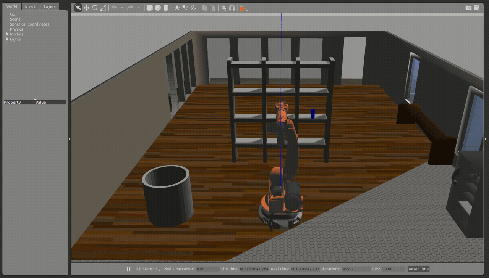
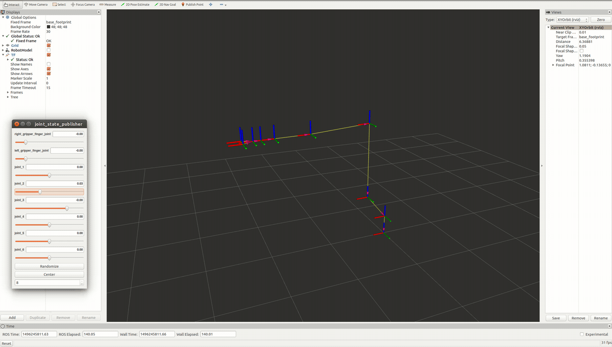

# Robotic Arm: Pick and Place (`Kinematics`)

Use knowledge of kinematics and ROS to manipulate a robotic arm in simulation with six degrees of freedom to pick up an object from one location and place it in another without running into obstacles.

* `simple_arm` - a mini-project to better understand pub-sub architecture in ROS.  

* `kuka_arm` - 

  * `urdf/kr210.urdf.xacro` - contains all the robot specific information like links, joints, actuators, etc.
  * `urdf/kr210.gazebo.xacro` - contains gazebo specific information like robot material, frictional constants, and plugins to control the robot in gazebo. 
  * `scripts/IK_server.py` - implements a ROS Server Node that caters to the `CalculateIK.srv` service. It receives end-effector poses from the pick and place simulator and is responsible to perform Inverse Kinematics, providing a response to the simulator with calculated joint variable values (six joint angles in our case).

* `kr210_claw_moveit` - contains all the configuration and launch files for using the kuka_arm with the MoveIt! Motion Planning Framework. 

* `gazebo_grasp_plugin` - Gazebo Model plugin(s) which handle/help grasping in Gazebo. 

## Intro to [Kinematics](https://en.wikipedia.org/wiki/Kinematics)

### Serial Manipulator Applications

Manipulator | Summary
:-------- |:-------- 
 | **Cartesian (PPP)** Pros: - Can have very high positional accuracy - Large payloads (gantry) - Simplest control strategy since there are no rotational movements - Very stiff structure Cons: - All the fixtures and associated equipment must lie within its workspace - Requires large operating volume Typical Applications: - Palletizing - Heavy assembly operations (e.g., cars and airplane fuselage)
 | **Cylindrical (RPP)** Pros: - Large, easy to visualize working envelope - Relatively inexpensive for their size and payload Cons: - Low average speed - Less repeatable than SCARA Typical Applications: - Depends on the size, small versions used for precision assembly, larger ones for material handling, machine loading/unloading
 | **Anthropomorphic (RRR)** Pros: - Large workspace - Compact design Cons: - Positional accuracy and repeatability is not as good as some other designs Typical Applications: - Welding, spray painting, deburring, material handling
 | **SCARA (RRP)** Pros: - Fast - Compact structure Cons: - Operations requiring large vertical motions Typical Applications: - Precision, high-speed, light assembly within a planar environment
 | **Spherical (RRP)** Pros: - Large working envelope Cons: - Complex coordinates more difficult to visualize, control, and program - Low accuracy - Relatively slow Typical Applications: - Material handling - Spot welding

### [Forward](https://en.wikipedia.org/wiki/Forward_kinematics) and [Inverse](https://en.wikipedia.org/wiki/Inverse_kinematics) Kinematics

  

* [Davenport chained rotations](https://en.wikipedia.org/wiki/Davenport_chained_rotations): are three chained intrinsic rotations about body-fixed specific axes.

* [Denavit-Hartenberg parameters](https://en.wikipedia.org/wiki/Denavit%E2%80%93Hartenberg_parameters): are the four parameters associated with a particular convention for attaching reference frames to the links of a spatial kinematic chain, or robot manipulator.

  

The parameter assignment process for open kinematic chains with n degrees of freedom (i.e., joints) is summarized as:

1. Label all joints from {1, 2, …, n}.
2. Label all links from {0, 1, …, n} starting with the fixed base link as 0.
3. Draw lines through all joints, defining the joint axes.
4. Assign the Z-axis of each frame to point along its joint axis.
5. Identify the common normal between each frame Z_(i-1) and frame Z_i.  
​6. The endpoints of "intermediate links" (i.e., not the base link or the end effector) are associated with two joint axes, {i} and {i+1}. For i from 1 to n, assign the X_i to be …  
  * For skew axes, along the normal between Z_i and Z_(i+1) and pointing from {i} to {i+1}.
  * For intersecting axes, normal to the plane containing Z_i and Z_(i+1).
  * For parallel or coincident axes, the assignment is arbitrary; look for ways to make other DH parameters equal to zero.
7. For the base link, always choose frame {0} to be coincident with frame {1} when the first joint variable (θ_1 or d_1) is equal to zero. This will guarantee that α_0 = a_0 = 0, and, if joint 1 is a revolute, d_1 = 0. If joint 1 is prismatic, then θ_1 = 0.
8. For the end effector frame, if joint n is revolute, choose X_n to be in the direction of X_(n−1)when θ_n = 0 and the origin of frame {n} such that d_n = 0.

## Kinematic Analysis and Implementation

#### 1. Run the forward_kinematics demo and evaluate the kr210.urdf.xacro file to perform kinematic analysis of Kuka KR210 robot and derive its DH parameters.

a DH parameter table with proper notations and description; 
a annotated figure of the robot with proper link assignments and joint rotations 

i       | α_(i-1) | a_(i-1) | d_i     | θ_i
------- | ------- | ------- | ------- | ------- 
1       | 0       | 0       | 0       | θ_1
2       | 0       | a_1     | 0       | θ_2
3       | 0       | a_2     | -d_3    | 0
4       | 0       | 0       | 0       | θ_4

#### 2. Using the DH parameter table derived earlier, create individual transformation matrices about each joint. In addition, also generate a generalized homogeneous transform between base_link and gripper_link using only end-effector(gripper) pose.

individual transform matrices about each joint using the DH table;
a homogeneous transform matrix from base_link to gripper_link using only the position and orientation of the gripper_link;

#### 3. Decouple Inverse Kinematics problem into Inverse Position Kinematics and Inverse Orientation Kinematics; doing so derive the equations to calculate all individual joint angles.

breakdown the IK problem into Position and Orientation problems, derive the equations for individual joint angles

#### 4. `IK_server.py` - explain the code and discuss the results.

## Resources

* [Sympy](http://www.sympy.org/en/index.html): a Python library for symbolic mathematics. It aims to become a full-featured computer algebra system (CAS) while keeping the code as simple as possible in order to be comprehensible and easily extensible.

* [Gazebo](http://gazebosim.org/): a physics based high fidelity 3D simulator for robotics. Gazebo provides the ability to accurately simulate one or more robots in complex indoor and outdoor environments filled with static and dynamic objects, realistic lighting, and programmable interactions.

* [RViz](http://wiki.ros.org/rviz): a tool to visualize all three core aspects of a robot: Perception, Decision Making, and Actuation.

* [MoveIt!](http://moveit.ros.org/): an advance motion planning framework for manipulation, kinematics, and control. It provides a platform for developing advanced robotics applications, evaluating new robot designs and building integrated robotics products for industrial, commercial, R&D and other domains.

* [The Kinematics and Dynamics Library (KDL)](http://www.orocos.org/kdl): an application independent framework for modelling and computation of kinematic chains, such as robots, biomechanical human models, computer-animated figures, machine tools, etc. It provides class libraries for geometrical objects (point, frame, line,... ), kinematic chains of various families (serial, humanoid, parallel, mobile,... ), and their motion specification and interpolation.

* [IKFast Solver](http://openrave.org/docs/0.8.2/interface_types/module/ikfast/): an IK solver allows dynamic loading and registering of ikfast shared objects to openrave plugins. Also contains several test routines for inverse kinematics.

