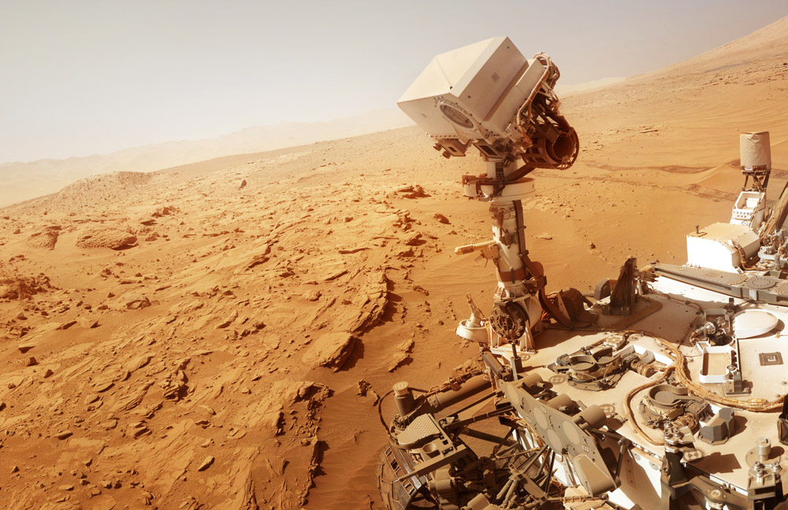
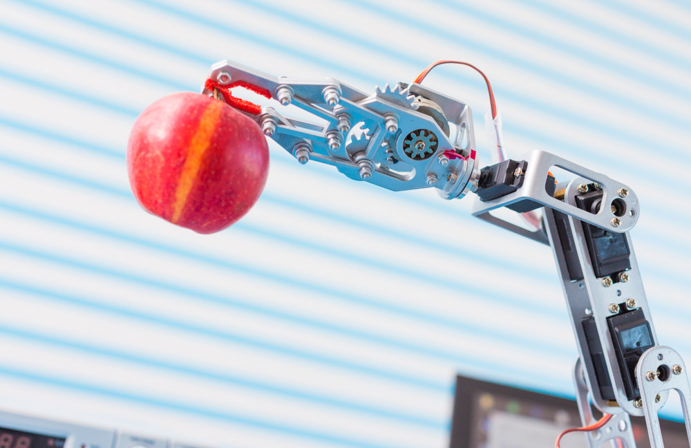
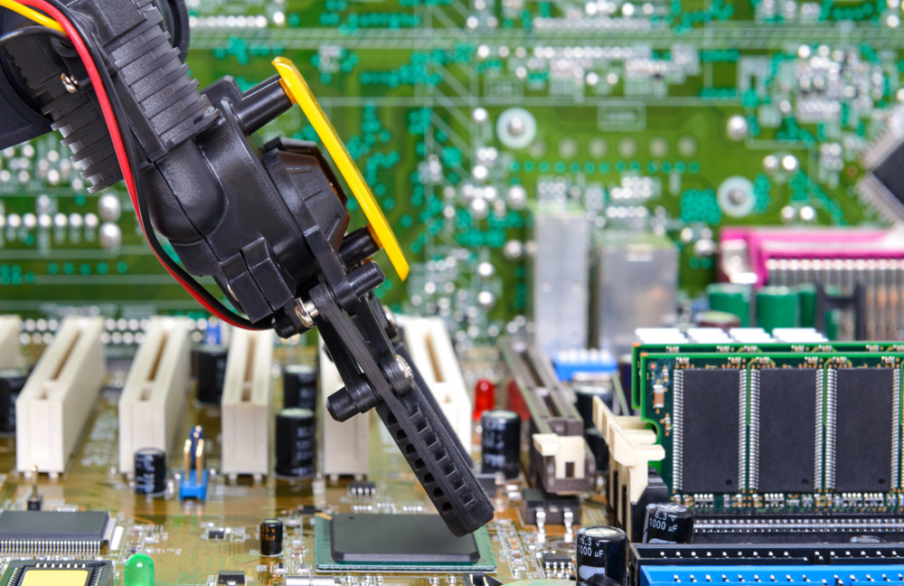
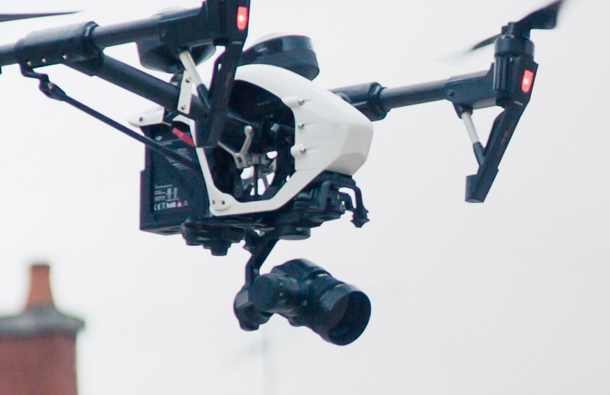

# Robotics

### Search and Sample Return (`Rover`)

Program a space rover to search for environmental samples in a simulated environment using computer vision techniques, including the three main steps in the robotics process: perception, decision making, and actuation. This project is modeled after the [NASA sample return challenge](https://www.nasa.gov/directorates/spacetech/centennial_challenges/sample_return_robot/index.html).

### Robotic Arm: Pick and Place

Use knowledge of Kinematics and ROS to manipulate a robotic arm in simulation with six degrees of freedom to pick up an object from one location and place it in another without running into obstacles.

### Robotic Arm: Perception and Control

Program a Willow Garage, two-armed PR2 robot in simulation to locate an object in a cluttered environment and then relocate it to a new location. Leverage MoveIt!, one of the most powerful software packages in the ROS ecosystem to perform collision detection and motion planning.

### Follow Me

Train a deep neural network to identify and track a target in simulation and then issue commands to a drone to follow that target. So-called “follow me” applications like this are key to many industries and the techniques applied here can be extended to other powerful scenarios like adaptive cruise control in autonomous vehicles or human-robot collaboration.
