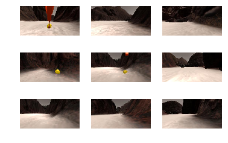
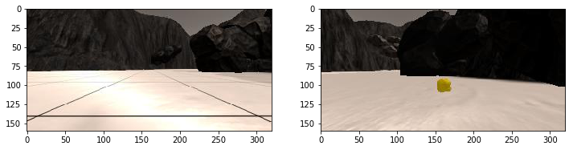
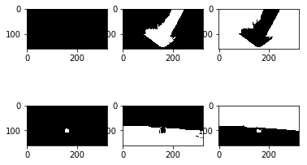
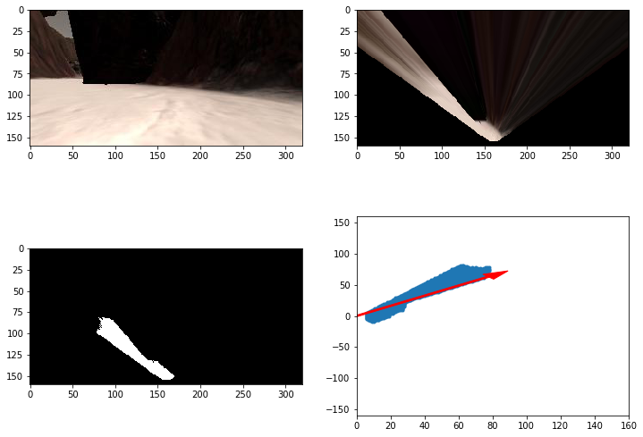
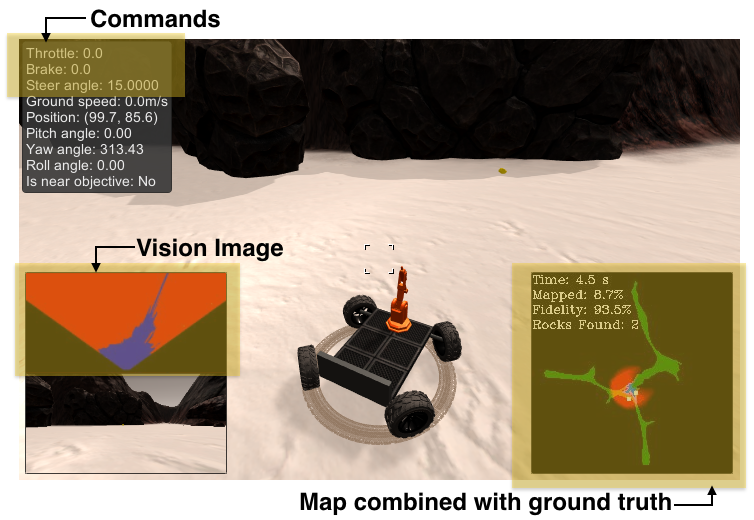

# Search and Sample Return

Program a space rover to search for environmental samples in a simulated environment using computer vision techniques, including the three main steps in the robotics process: perception, decision making, and actuation. This project is modeled after the [NASA sample return challenge](https://www.nasa.gov/directorates/spacetech/centennial_challenges/sample_return_robot/index.html).

  |  
:-------------------------:|:-------------------------:

* `Rover_test.ipynb`: test functions for performing the various steps of this project and visualize outputs
* `perception.py`: process and map images
* `decision.py`: determine throttle, brake and steer commands 
* `drive_rover.py`: the main script for autonomous navigation and mapping 
* `supporting_functions.py`: `update_rover() - RoverState()` object gets updated with each new batch of telemetry. The `create_output_images()` function compares Rover.worldmap with the ground truth map and gets converted, along with Rover.vision_image, into base64 strings to send back to the rover.  
* `keras_models`: try a deep leanring approach similar to the [Behavioral_Cloning](https://github.com/LuLi0077/SDC/tree/master/Behavioral_Cloning) project

(simulator setting - screen resolution: 800 x 600; graphics quality: Good)

## Detailed Approach

### `Rover_test.ipynb`

1. Run the simulator in "Training Mode" and record some data

- Number of examples = 25462
- Average steering angles = 0.260380830098    
- Average throttle = 0.0993611430696  
- Average brake = 0.0456758897964   
- Average speed = 0.639068834241   
- Average pitch = 198.387466718    
- Average yaw = 168.132484076    
- Average roll = 112.724103404  

2. Calibration and perspective transformation

Select four points in the "source" image (left) and map them to four points in the "destination" image, which will be the top-down view (right).

  |  
:-------------------------:|:-------------------------:

3. Color thresholding

Take a color image and output a single-channel binary image, which is to say an image with a single color channel where every pixel is set to one or zero. Identify pixels above some thresholds and set them to one can separate ground, obstacles and rocks in an image. 

Thresholds are as following in the RGB color space:  
* Ground - [160, 160, 160]:[255, 255, 255]
* Obstacle - [0, 0, 0]:[160, 160, 160]
* Rock - [100, 100, 0]:[180, 180, 40]

Using these two images as examples:  

The three columns are corresponding to binary output above threshold (color white) for rock, groud and obstical. 

4. Coordinate transformations

* `rover_coords()`: convert x and y pixel positions in image space of the navigable terrain to rover-centric coordinates 
* `to_polar_coords()`: convert x and y pixel positions to polar coordinates, where each pixel position is represented by its distance from the origin and angle counterclockwise from the positive x-direction
* `rotate_pix()`: rotate the rover-centric coordinates so that the x and y axes are parallel to the axes in world space
* `pix_to_world()`: translate the rotated positions by the x and y position values given by the rover's location (position vector) in the world

5. Process image

- Apply perspective transform
- Apply color threshold to identify navigable terrain/obstacles/rock samples
- Convert thresholded image pixel values to rover-centric coords
- Update vision_image
- Convert rover-centric pixel values to world coords
- Update worldmap
- Convert rover-centric pixel positions to polar coordinates
- Make a mosaic image
- Make a video from processed image data: `test_mapping.mp4`

6. Try a deep learning approach

Mimic the [Behavioral Cloning](https://github.com/LuLi0077/SDC/tree/master/Behavioral_Cloning) project, train a deep neural network to drive the rover in autonomous mode. The network takes in an image from the camera of the rover and outputs steer, throttle and brake. 

Data is split 90/10 into train and validation sets. Then use image and batch generators to read data from each file, augment on the fly and use it to train/validate the model. The network architecture is adapted from NVIDIA's [End to End Learning for Self-Driving Cars](https://arxiv.org/pdf/1604.07316v1.pdf).

In the **keras_models** folder:  
* drive.py - The script used to drive the car.
* model.json - The model architecture.
* model.h5 - The model weights.

### `perception.py`

Perform perception steps to update Rover() (main functions are the same as in `Rover_test.ipynb`) - 
1. Define source and destination points for perspective transform
2. Apply perspective transform
3. Apply color threshold to identify navigable terrain/obstacles/rock samples
4. Update Rover.vision_image (this will be displayed on left side of screen)
5. Convert map image pixel values to rover-centric coords
6. Convert rover-centric pixel values to world coordinates
7. Update Rover worldmap (to be displayed on right side of screen)
8. Convert rover-centric pixel positions to polar coordinates and update Rover pixel distances and angles

### `decision.py`

1. Define functions for rover to go forward, stop, turn and reverse.
2. `decision_step()` contains simple "if...then..." logics for rover command:
- If we have vision data:
	- check if a rock is in-sight for pick up: if so, pick up the rock;
	- check if the area right in front of the rover is open and there's enough space ahead: 
		- if so, move forward;
		- if not, stop and turn.
- If we don't have vision data: stop and reverse.

Here's a [video](https://youtu.be/dMx_MQkzo90) of the final output.

## Possible improvements

The current approach meet the requirement of map at least 40% of the environment at 60% fidelity and locate at least one of the rock samples. The goal in the [NASA sample return challenge](https://www.nasa.gov/directorates/spacetech/centennial_challenges/sample_return_robot/index.html) was not just to locate samples of interest but also to pick them up and return them to the starting point. The primary metrics of interest are time, percentage mapped, fidelity and number of rocks found. 

* Optimizing time: Moving faster and more efficiently will minimize total time. 
	- Incorporate [PID](https://github.com/LuLi0077/SDC/tree/master/PID_Control) or [MPC](https://github.com/LuLi0077/SDC/tree/master/Model_Predictive_Control) controllers for steering and speed.
	- Avoid revisiting previously mapped areas.

* Optimizing % mapped: "close" boundaries in the map. 

* Optimizing for finding all rocks: make the rover a "wall crawler" that explores the environment by always keeping a wall on its left or right. 
